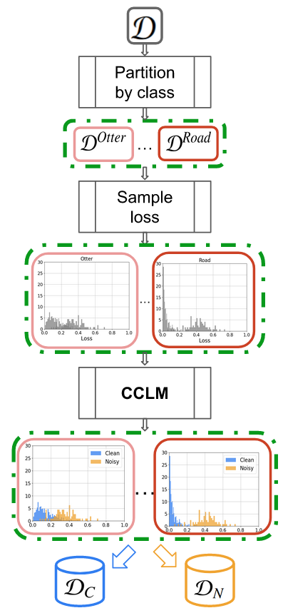

# CCLM: Class-conditional Label Noise Modelling

PyTorch Code for the following paper at IbPRIA2023
**Title**: CCLM: Class-conditional Label Noise Modelling

**Authors**: Albert Tatjer, Bhalaji Nagarajan, Ricardo Marques, Petia Radeva

**Insitute**: Universitat de Barcelona

**Abstract**: The performance of deep neural networks highly depends
on the quality and volume of the training data. However, cost-effective
labelling processes such as crowdsourcing and web crawling often lead
to data with noisy (i.e., wrong) labels. Making models robust to this
label noise is thus of prime importance. A common approach is using
loss distributions to model the label noise. However, the robustness of
these methods highly depends on the accuracy of the division of training
set into clean and noisy samples. In this work, we dive in this research
direction highlighting the existing problem of treating this distribution
globally and propose a class-conditional approach to split the clean and
noisy samples. We apply our approach to the popular DivideMix algo-
rithm and show how the local treatment fares better with respect to the
global treatment of loss distribution. We validate our hypothesis on two
popular benchmark datasets and show substantial improvements over the
baseline experiments. We further analyze the effectiveness of the proposal
using two different metrics - Noise Division Accuracy and Classiness.

**Illustration**


**Code**
Please note that CCLM proposes a very simple change in any LNL codebase. In this repository we demonstrate how to undertake this procedure with the base code of DivideMix and C2D. All the new (relevant) code is in *class_conditional_utils.py*. Finally, one has to call *class_conditional_utils.py/ccgmm_codivide()* from the *eval_train()* function accordingly.

**Experiments**
To run the experiments, choose a baseline, {C2D, DivideMix}
*DivideMix*

```bash
$ cd DivideMix
$ mkdir checkpoint
$  python Train_{dataset_name}.py --data_path path-to-your-data --cc
```
For more information please refer to the [DivideMix repository](https://github.com/LiJunnan1992/DivideMix)

*C2D*
You first need to download the appropiate pretrained model, [here](https://drive.google.com/drive/folders/1qYVdggtNFQZBZ-OqVJm80LBKUKpdLPUm?usp=sharing) for more information please refer to the [C2D repository](https://github.com/ContrastToDivide/C2D)
```bash
$ python3 main_cifar.py --r 0.8 --lambda_u 500 --dataset cifar100 --p_threshold 0.03 --data_path path-to-your-data --experiment-name name-of-your-choice --method selfsup --net resnet50 --cc
```

Note  that the argument `--cc` will choose the option class-conditional, otherwise you would run the vanilla baseline.


**License**
This project is licensed under the terms of the MIT license.